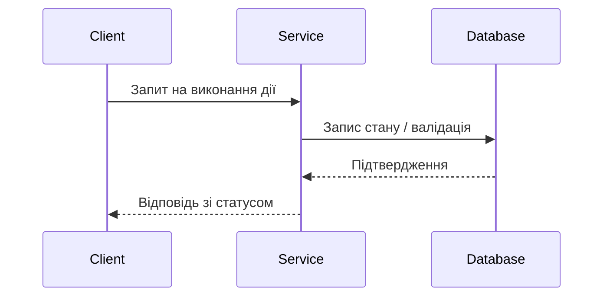

# [Назва компонента / Модуля]: Архітектурна специфікація

> **Статус**: [Чернетка / На узгодженні / Затверджено / В роботі]  
> **Автор (Архітектор)**: @system-architect  
> **Виконавець**: @implementer  
> **QA-рев'ювер**: @qa-engineer  
> **Дата**: YYYY-MM-DD  

---

## 1. Контекст та мета
Короткий опис проблеми, яку ми вирішуємо, передумови та цілі створення або зміни цього компонента.

- **Основна мета**: ...
- **Межі відповідальності (Scope)**: Що входить у задачу, а що категорично винесено за дужки (Out of scope).

---

## 2. Схема взаємодії та структура даних

### Інтерфейсні контракти (Interfaces / API)
```typescript
export interface ComponentContract {
  id: string;
  name: string;
  execute(params: ExecutionParams): Promise<ExecutionResult>;
}
```

### Діаграма послідовності (Mermaid)


---

## 3. Технічні вимоги та залежності
- **Необхідні бібліотеки/пакети**: ...
- **Конфігураційні параметри**: ...

---

## 4. Обробка помилок та граничні випадки (Edge Cases)
| Сценарій / Помилка | Очікувана поведінка системи | Код / Повідомлення помилки |
| :--- | :--- | :--- |
| Відсутність обов'язкових полів | Рання валідація, повернення 400 | `VALIDATION_FAILED` |
| Тайм-аут з'єднання | Повторна спроба (backoff) | `NETWORK_TIMEOUT` |

---

## 5. Критерії приймання (Acceptance Criteria)
- [ ] Контракт повністю реалізовано без порушення зворотньої сумісності.
- [ ] Охоплено модульними тестами.
- [ ] Відсутні помилки типізації та лінтера.
